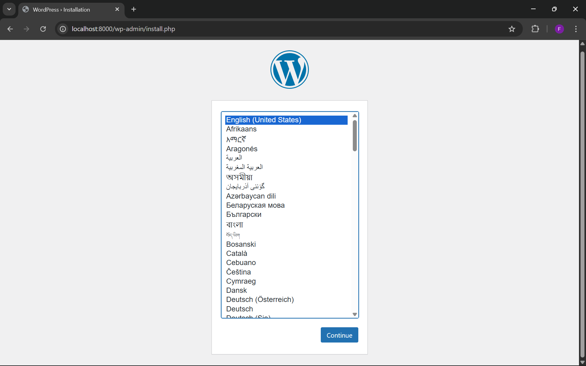
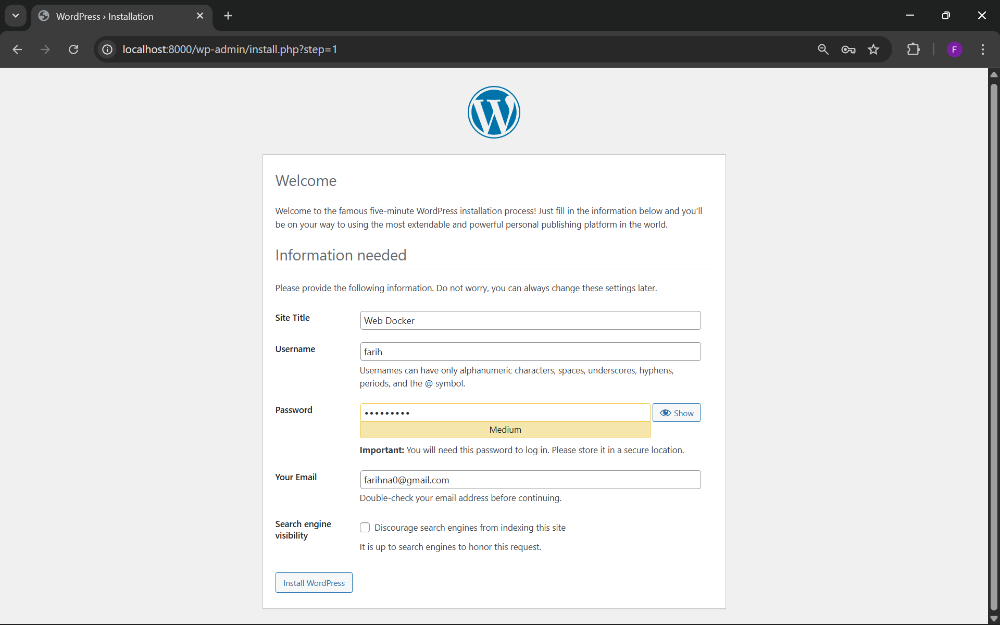
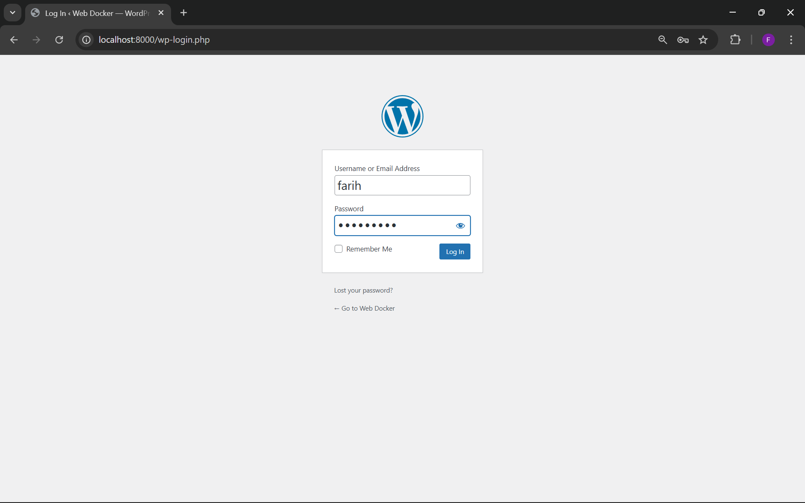
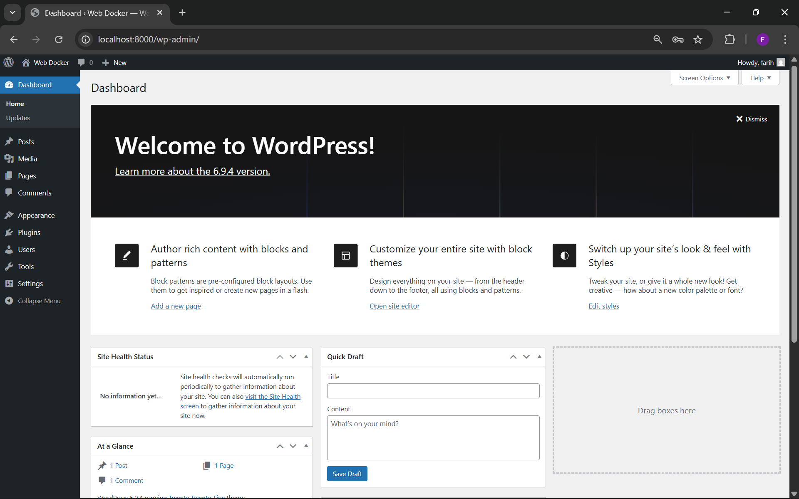
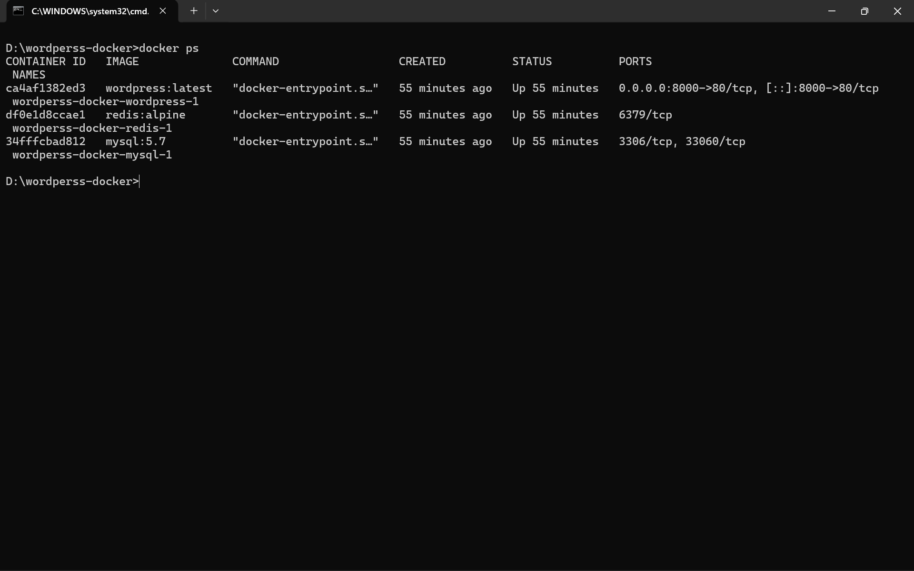

# WordPress Docker Stack

> Multi-container WordPress setup menggunakan Docker Compose dengan MySQL sebagai database dan Redis sebagai object cache.

## Cara Menjalankan Stack

```bash
# 1. Masuk ke folder project
cd wordpress-docker

# 2. Jalankan semua container di background
docker compose up -d

# 3. Cek status container (harus muncul 3 container "Up")
docker ps

# 4. Akses WordPress di browser
#    http://localhost:8000
```

### Menghentikan Stack

```bash
# Stop container (data tetap tersimpan)
docker compose down

# Stop container + hapus semua data
docker compose down -v
```

---

## Screenshots

### 1. WordPress Installation Page

**Pemilihan Bahasa** — Memilih bahasa sistem WordPress.



**Konfigurasi Akun** — Membuat username admin dan password.



---

### 2. WordPress Dashboard

**Login ke Dashboard** — Proses masuk ke halaman administrasi.



**Tampilan Dashboard** — WordPress siap digunakan.



---

### 3. Docker Processes

Membuktikan 3 container (WordPress, MySQL, Redis) berstatus `Up`.



---

### 4. Redis CLI Ping Test

Uji respons Redis dengan perintah `redis-cli ping` — hasil `PONG` membuktikan Redis aktif.


---

## Jawaban Pertanyaan

### 1. Kenapa perlu volume untuk MySQL?

MySQL menyimpan data di dalam container yang bersifat **sementara (ephemeral)**. Tanpa volume, seluruh data — posts, users, settings — akan hilang permanen setiap kali container dihentikan atau dihapus.

Dengan volume `mysql_data`, data dipersistensikan ke storage host sehingga tetap ada meskipun container di-restart atau diganti dengan versi baru.

```yaml
volumes:
  - mysql_data:/var/lib/mysql  # data MySQL di-mount ke host
```

---

### 2. Apa fungsi `depends_on`?

`depends_on` mendefinisikan **urutan startup** antar container. Konfigurasi berikut:

```yaml
wordpress:
  depends_on:
    - mysql
    - redis
```

...memastikan container `mysql` dan `redis` dijalankan lebih dulu sebelum `wordpress` dimulai. Ini penting karena WordPress membutuhkan koneksi database yang sudah siap saat proses inisialisasi pertama kali berjalan.

---

### 3. Bagaimana cara WordPress container connect ke MySQL?

Di dalam Docker network (`wp_network`), setiap container dapat saling berkomunikasi menggunakan **nama service sebagai hostname**. Konfigurasi:

```yaml
WORDPRESS_DB_HOST: mysql:3306
```

Berarti WordPress terhubung ke hostname `mysql` pada port `3306`. Docker DNS internal secara otomatis me-resolve nama service `mysql` ke IP container MySQL yang bersangkutan — tanpa perlu mengetahui IP address-nya secara manual.

---

### 4. Apa keuntungan pakai Redis untuk WordPress?

| Keuntungan | Penjelasan |
|---|---|
| **Performa lebih cepat** | Query yang sering dipanggil (menu, widget, options) disimpan di RAM — tidak perlu hit ke MySQL setiap request |
| **Beban database berkurang** | Traffic tinggi dilayani cache terlebih dahulu, MySQL hanya diakses untuk data yang belum di-cache |
| **Waktu respons rendah** | Akses Redis (in-memory) jauh lebih cepat dibanding disk I/O MySQL |
| **Scalable** | Cocok untuk WordPress dengan traffic besar atau banyak plugin aktif |

---