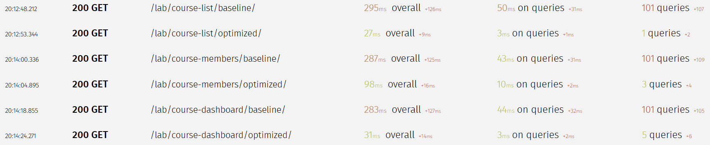
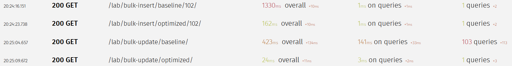
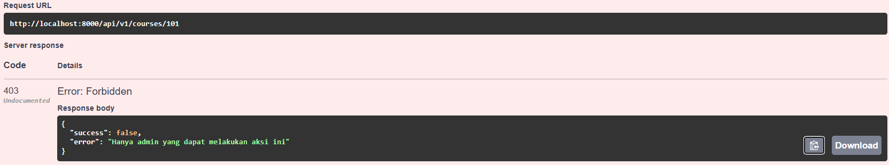
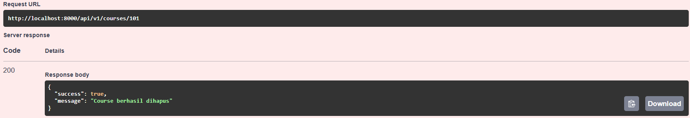
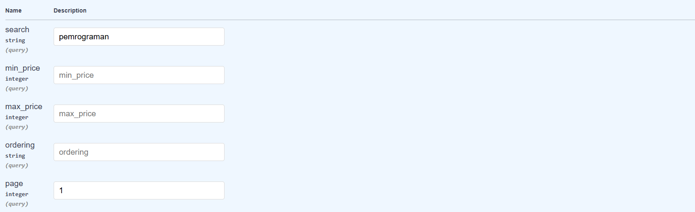
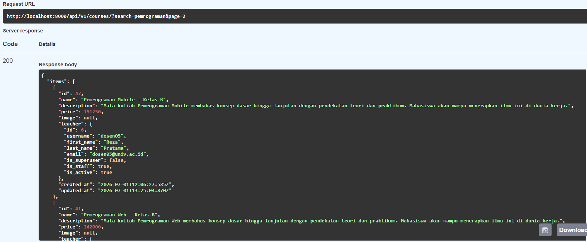

# Simple LMS — Backend API
Backend API untuk aplikasi Learning Management System (LMS) sederhana berbasis Django 5.1 dan Django Ninja. Mendukung manajemen course, enrollment mahasiswa, progress materi, komentar, autentikasi JWT, dan caching Redis.

---
## Tech Stack
| Teknologi | Kegunaan |
| :--- | :--- |
| **Django 5.1** | Web framework utama |
| **Django Ninja** | REST API framework (OpenAPI/Swagger otomatis) |
| **PostgreSQL 16** | Database utama |
| **Redis 7** | Cache layer (course list & detail) |
| **MongoDB 7** | Penyimpanan activity log & analytics |
| **Celery + RabbitMQ** | Async task (email konfirmasi, generate sertifikat) |
| **Docker + Docker Compose** | Containerisasi seluruh service |
| **django-silk** | Profiling & monitoring query database |

---
## Cara Menjalankan
1. **Clone Repository**

    ```bash
    git clone https://github.com/Farihna/docker-project.git
    cd simple-lms
    ```
2. **Jalankan Docker**

    ```bash
    docker compose up -d
    ```
    Semua service (app, PostgreSQL, Redis, Celery) akan berjalan otomatis.
3. **Inisialisasi Database**

    ```bash
    docker compose exec web python manage.py migrate
    ```
4. **Generate RSA Key (untuk JWT)**

    ```bash
    docker compose exec web python manage.py make_rsa
    ```
5. **Seed Data**

    ```bash
    docker compose exec web python manage.py seed_data
    ```
    Perintah ini akan membuat:
    - 1 superuser (`admin`)
    - 20 pengajar (`dosen01` - `dosen20`)
    - 80 mahasiswa (`mhs001` - `mhs080`)
    - 100 course, 300 materi, 500 enrollment, 1000+ komentar
6. **Akses Aplikasi**

    | Layanan | URL | Deskripsi / Kredensial |
    | :--- | :--- | :--- |
    | **Swagger UI** | [http://localhost:8000/api/v1/docs](http://localhost:8000/api/v1/docs) | Dokumentasi API (Endpoints) |
    | **Django Admin** | [http://localhost:8000/admin](http://localhost:8000/admin) | Panel Admin Django (Gunakan akun *superuser*) |
    | **RabbitMQ UI** | [http://localhost:15672](http://localhost:15672) | Monitor message broker (guest / guest) |
    | **Flower** | [http://localhost:5555](http://localhost:5555) | Monitor Celery tasks |

7. **Akun Demo**

    | Role | Username | Password |
    | :--- | :--- | :--- |
    | **Superadmin** | `admin` | `password123` |
    | **Instructor** | `dosen01` | `password123` |
    | **Student** | `mhs001` | `password123` |

8. **Cara Mendapatkan Token JWT**

    Lewat Swagger UI:

    - Buka **Swagger UI** di browser: [http://localhost:8000/api/v1/docs](http://localhost:8000/api/v1/docs).
    - Cari dan klik pada *endpoint* **`POST /api/v1/auth/sign-in`**.
    - Klik tombol **"Try it out"** di sebelah kanan.
    - Masukkan salah satu `username` dan `password` dari daftar **Akun Demo** di atas pada bagian *Request Body*.
    - Klik tombol **Execute**. Jika berhasil, Anda akan menerima respons `200 OK` yang berisi token:
        ```json
        {
            "refresh": "eyJhbGciOiJIUzI1NiIsInR5cCI6IkpXVCJ9...",
            "access": "eyJhbGciOiJIUzI1NiIsInR5cCI6IkpXVCJ9..."
        }
        ```
    - Copy nilai `access` dari response.
    - Klik tombol **Authorize** di pojok kanan atas halaman Swagger.
    - Pada kolom `Bearer (http, Bearer)`, paste token yang sudah dicopy.
    - Klik **Authorize**, lalu **Close**. Sekarang semua endpoint yang memerlukan autentikasi sudah bisa diakses.

---
## Endpoint Utama

Base URL: `http://localhost:8000/api/v1`

### Auth
| Method | Endpoint | Akses | Deskripsi |
| :--- | :--- | :--- | :--- |
| `POST` | `/auth/sign-in` | Public | Login, mendapatkan token JWT |
| `POST` | `/auth/token-refresh` | Public | Refresh access token |
| `POST` | `/register/` | Public | Registrasi akun baru |
| `GET` | `/auth/me` | User | Lihat profil sendiri |
| `PUT` | `/auth/me` | User | Update profil sendiri |

### Course
| Method | Endpoint | Akses | Deskripsi |
| :--- | :--- | :--- | :--- |
| `GET` | `/courses/` | Public | List semua course (filtering, sorting, pagination) |
| `GET` | `/courses/{id}` | Public | Detail course beserta materi |
| `POST` | `/courses/` | Instructor | Buat course baru |
| `PATCH` | `/courses/{id}` | Instructor | Update course |
| `DELETE` | `/courses/{id}` | Admin | Hapus course |

### Enrollment
| Method | Endpoint | Akses | Deskripsi |
| :--- | :--- | :--- | :--- |
| `POST` | `/enrollments` | Student | Daftar ke course |
| `GET` | `/enrollments/mycourses` | Student | Lihat course yang diikuti |
| `POST` | `/enrollments/{content_id}/progress` | Student | Tandai materi selesai |

### Komentar
| Method | Endpoint | Akses | Deskripsi |
| :--- | :--- | :--- | :--- |
| `POST` | `/comments/` | Student | Tambah komentar pada materi |
| `PUT` | `/comments/{id}` | Student | Edit komentar sendiri |
| `DELETE` | `/comments/{id}` | Student/Instructor/Admin | Hapus komentar |

### Analytics
| Method | Endpoint | Akses | Deskripsi |
| :--- | :--- | :--- | :--- |
| `GET` | `/analytics/enrollments` | Admin | Jumlah enrollment per course |
| `GET` | `/analytics/activity` | Admin | Ringkasan aktivitas N hari terakhir |

---
## Fitur yang Diimplementasikan

### Fondasi
- Autentikasi JWT (login, refresh token, register)
- Role-based access control (Admin, Instructor, Student)
- Manajemen course (CRUD)
- Enrollment mahasiswa ke course
- Progress tracking materi
- Komentar pada materi
- Activity log berbasis MongoDB
- Async task dengan Celery (email konfirmasi enrollment, generate sertifikat)

### Paket 4 — Performance & API Quality
- **Redis Caching** — course list (TTL 10 menit) dan course detail (TTL 15 menit)
- **Cache Invalidation** — cache otomatis terhapus saat course dibuat, diupdate, atau dihapus
- **Filtering** — `?search=`, `?min_price=`, `?max_price=` pada endpoint course list
- **Sorting** — `?ordering=` dengan pilihan `name`, `price`, `created_at` (ascending/descending)
- **Pagination** — 10 item per halaman, navigasi via `?page=`
- **Cache Key Dinamis** — setiap kombinasi filter menghasilkan cache key unik, tidak saling tabrakan
- **Response & Error Format Konsisten** — semua error menggunakan format `{"success": false, "error": "..."}`, semua aksi sukses menggunakan `{"success": true, "message": "..."}`
- **Optimasi Query & N+1 Fixing** — dibuktikan dengan django-silk (lihat bagian Query Optimization)
- **Rate Limiting** — 60 request/menit per user/IP, return 429 jika terlampaui


---
## Query Optimization & N+1 Fixing

Dibuktikan menggunakan **django-silk** profiler. Akses hasil profiling di `http://localhost:8000/silk/`

Endpoint lab tersedia di:
- `GET /lab/course-list/baseline/` vs `/lab/course-list/optimized/`
- `GET /lab/course-members/baseline/` vs `/lab/course-members/optimized/`
- `GET /lab/course-dashboard/baseline/` vs `/lab/course-dashboard/optimized/`
- `GET /lab/bulk-insert/baseline/{course_id}/` vs `/lab/bulk-insert/optimized/{course_id}/`
- `GET /lab/bulk-update/baseline/` vs `/lab/bulk-update/optimized/`

### Hasil Perbandingan

| Skenario | Versi | Queries | Query Time | Overall |
| :--- | :--- | :--- | :--- | :--- |
| Course List | Baseline | 101 | 50ms | 295ms |
| Course List | **Optimized** | **1** | **3ms** | **27ms** |
| Course Members | Baseline | 101 | 43ms | 287ms |
| Course Members | **Optimized** | **3** | **10ms** | **98ms** |
| Course Dashboard | Baseline | 101 | 44ms | 283ms |
| Course Dashboard | **Optimized** | **5** | **3ms** | **31ms** |
| Bulk Insert | Baseline | 1 | 1ms | 1330ms |
| Bulk Insert | **Optimized** | **1** | **1ms** | **162ms** |
| Bulk Update | Baseline | 103 | 141ms | 423ms |
| Bulk Update | **Optimized** | **1** | **3ms** | **24ms** |




### Teknik Optimasi yang Digunakan
- `select_related()` — menghindari N+1 pada ForeignKey (teacher, course)
- `prefetch_related()` — menghindari N+1 pada relasi many-to-many/reverse FK
- `aggregate()` — mengganti loop query dengan single aggregation query
- `bulk_create(batch_size=500)` — insert massal tanpa loop `save()`
- `bulk_update()` via `F()` expression — update massal tanpa loop per objek

---
## Struktur Project

```
simple-lms/
├── docker-compose.yml
└── code/
    ├── manage.py
    ├── requirements.txt
    ├── weather_api.py          # Demo Cache-Aside Pattern (Redis Exercise)
    ├── test_cache.py           # Testing script Redis caching
    ├── cache_report.md         # Laporan Redis Caching Exercise
    ├── lms/                    # Konfigurasi utama Django
    │   ├── settings.py
    │   ├── urls.py
    │   └── celery.py
    ├── core/                   # API utama & shared modules
    │   ├── apiv1.py            # Semua endpoint Django Ninja
    │   ├── schemas.py          # Schema request/response
    │   ├── cache.py            # Redis caching & rate limiting
    │   ├── helpers.py          # Role & permission helpers
    │   └── mongodb.py          # Activity log & analytics
    └── courses/                # App courses
        ├── models.py           # Model Course, CourseMember, dll
        ├── migrations/         # Histori skema database
        ├── views.py            # Endpoint lab (N+1 demo)
        ├── tasks.py            # Celery async tasks
        ├── admin.py            # Django Admin config
        ├── urls.py             # API Routing
        └── management/
            └── commands/
                └── seed_data.py
```

---
## Bukti Implementasi

### Swagger UI


### Docker Containers — Semua Service Berjalan


### Redis Caching & Cache Invalidation
Cache aktif — key tersimpan di Redis:


Setelah course diupdate/dihapus — key otomatis terhapus:


### Response Format Konsisten
Error (403 — role tidak cukup):


Sukses (delete course):


### Filtering & Pagination




### Celery Tasks (Flower)


### RabbitMQ


### MongoDB Activity Logs
