# SIMPLE LMS API DOCUMENTATION

## 1. API ENDPOINTS & DOCUMENTATION
Menampilkan seluruh daftar fungsionalitas yang tersedia pada sistem LMS.

## 2. JWT AUTHENTICATION
Sistem keamanan menggunakan JSON Web Token untuk proteksi data.

### Token Generation
Proses login untuk mendapatkan access dan refresh token.
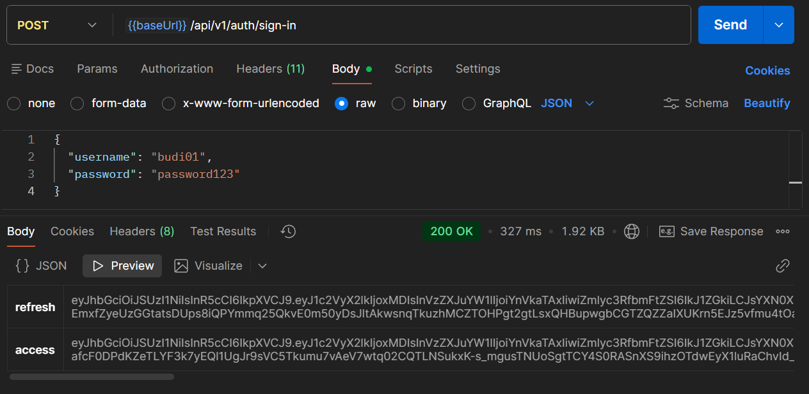

### Security Protection
Respon (401 Unauthorized) saat mencoba akses endpoint terproteksi tanpa token.
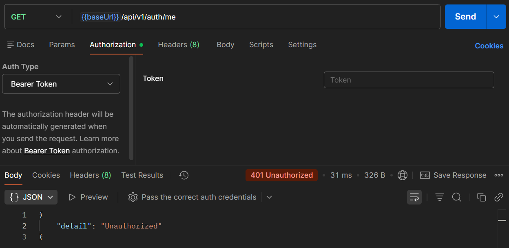

Akses berhasil setelah menyertakan token yang valid.
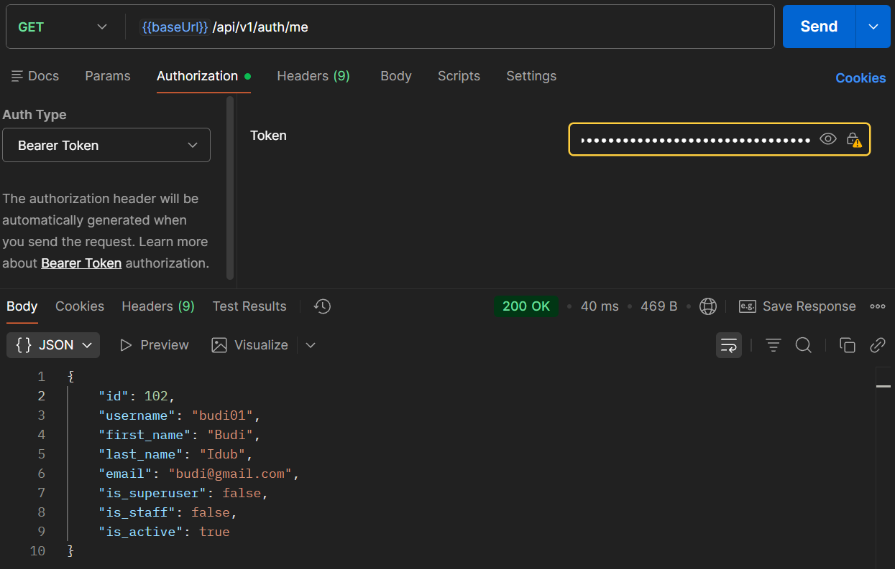

## 3. RBAC (ROLE-BASED ACCESS CONTROL)
Pembatasan hak akses berdasarkan peran pengguna:
- **Admin**: Akses penuh melalui `@admin_required`.
- **Instructor**: Izin membuat dan mengelola kursus melalui `@instructor_required`.
- **Student**: Akses konten dan komentar melalui `@student_required`.

### Testing RBAC
Contoh penolakan akses (403 Forbidden) saat user biasa mencoba mengakses fitur instruktur.
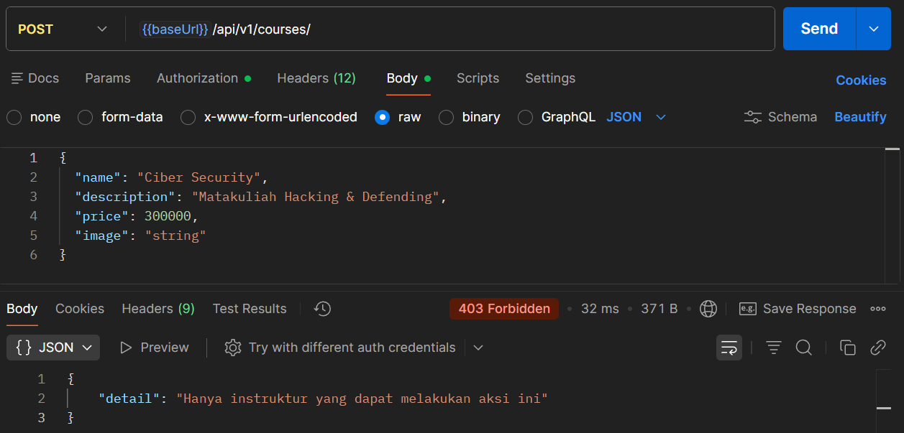

## 4. SCHEMA VALIDATION
Validasi integritas data menggunakan Pydantic untuk mencegah data cacat masuk ke database.

- **Tipe data tidak sesuai (422 Error)**:
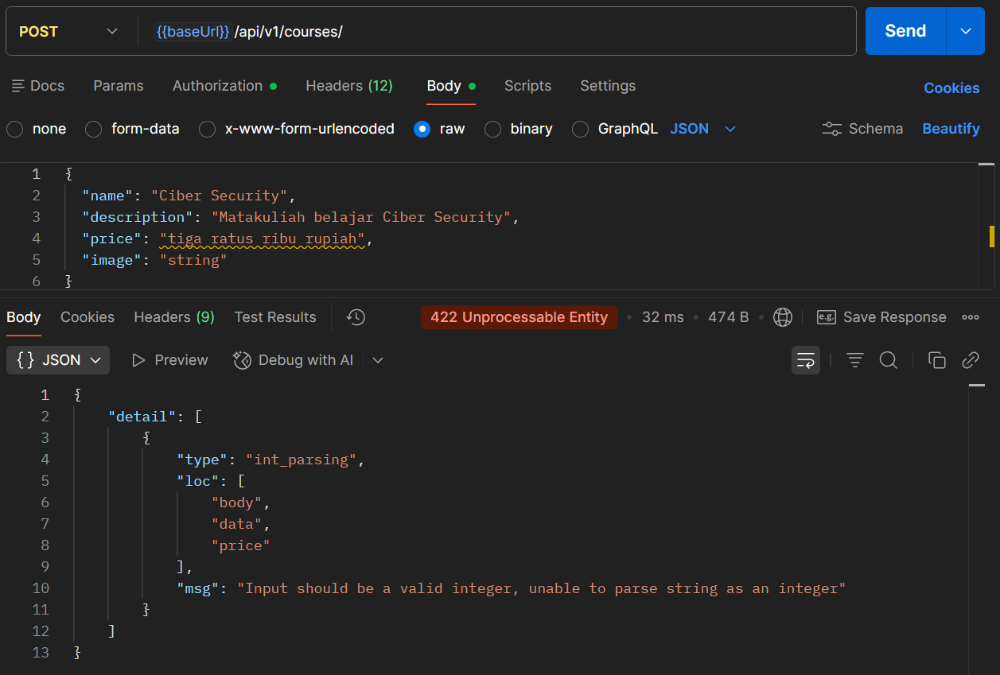

- **Field wajib tidak diisi**:
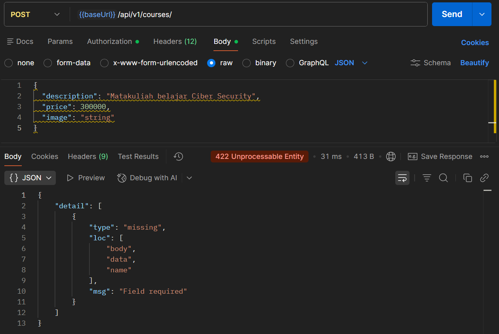

- **Input Valid (Success)**:
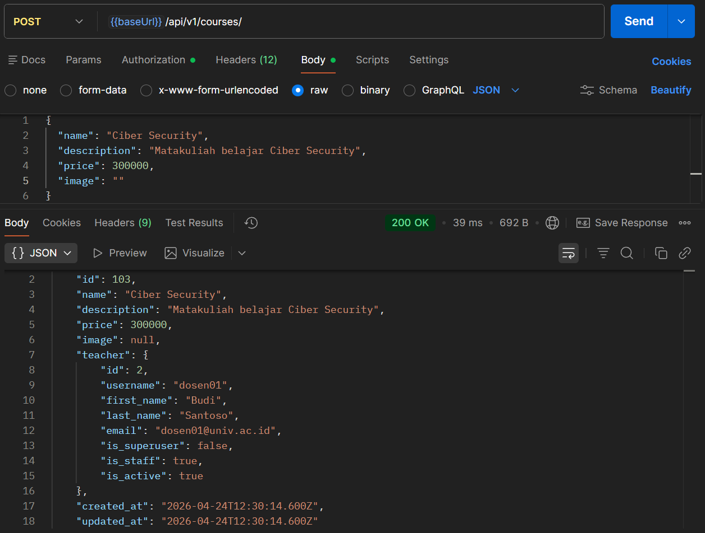

## 5. POSTMAN COLLECTION & AUTOMATION
Koleksi request API yang terorganisir, mencakup seluruh endpoint yang telah diimplementasikan. Koleksi ini dilengkapi dengan pengaturan environment untuk fleksibilitas pengujian di berbagai server.

**Struktur folder:**
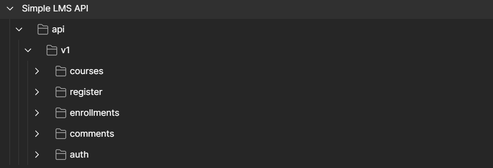
**Daftar request pada Postman:**
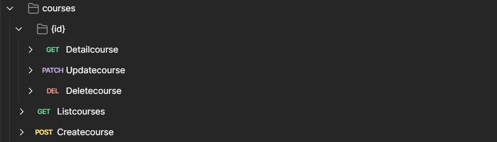
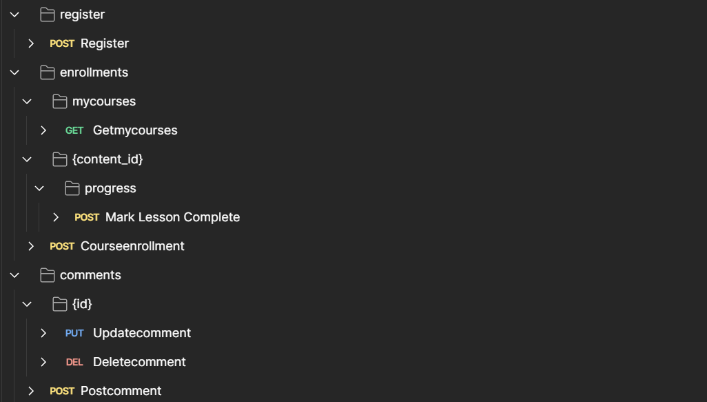
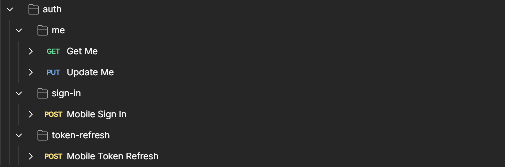