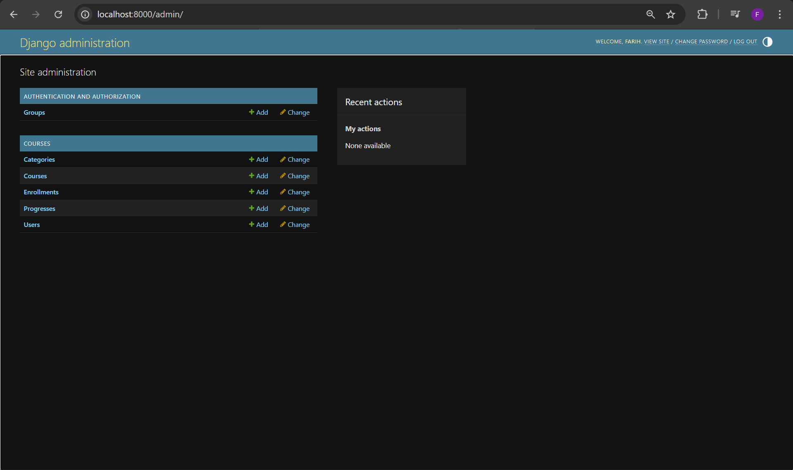
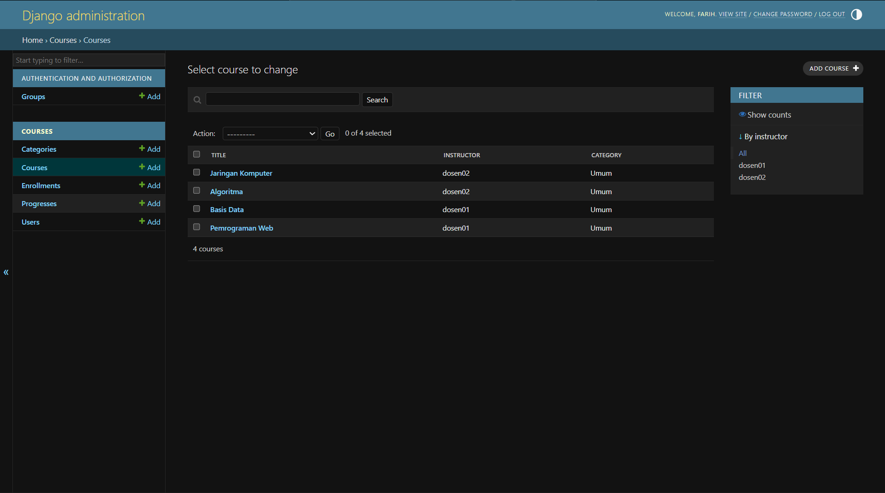
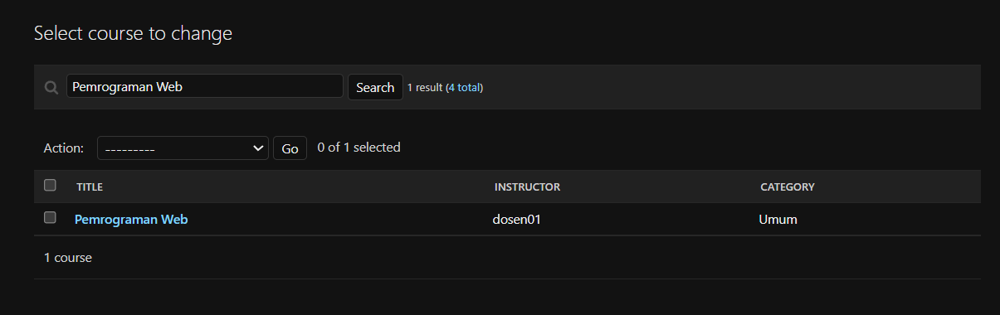
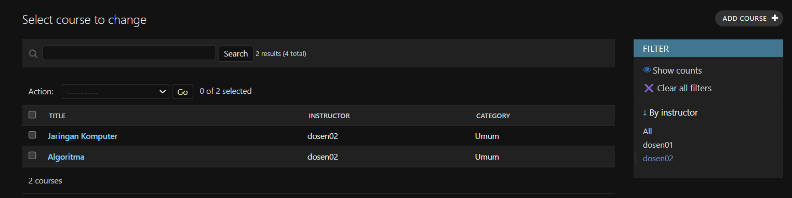
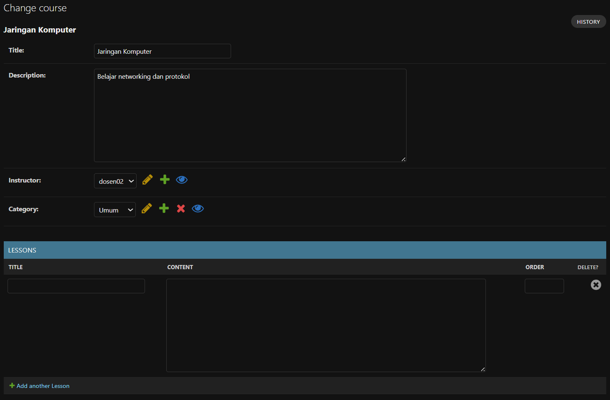
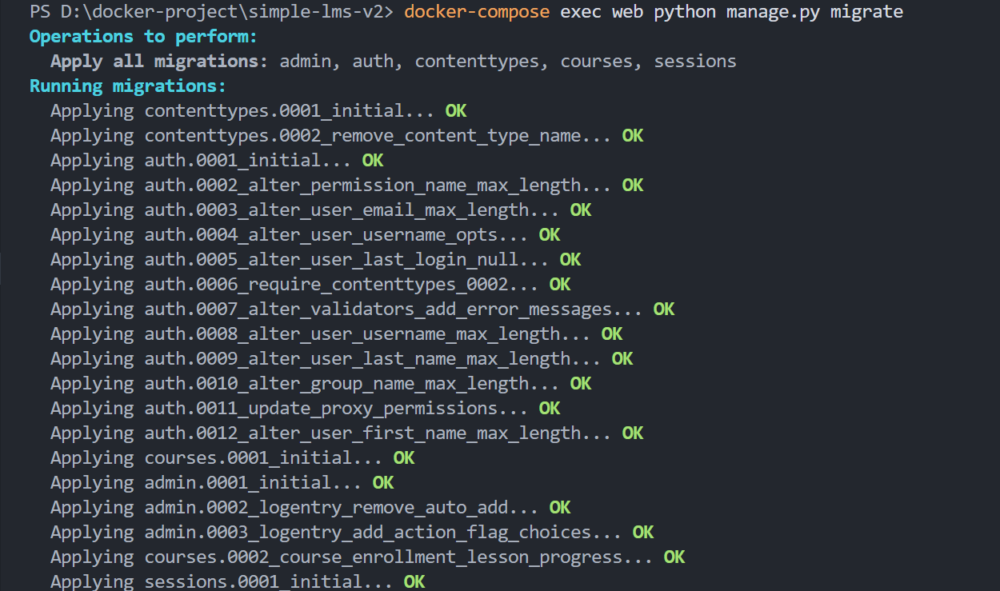
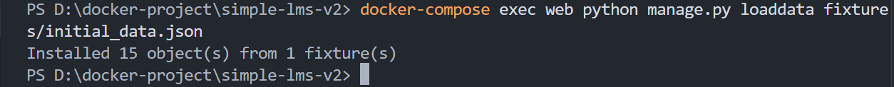
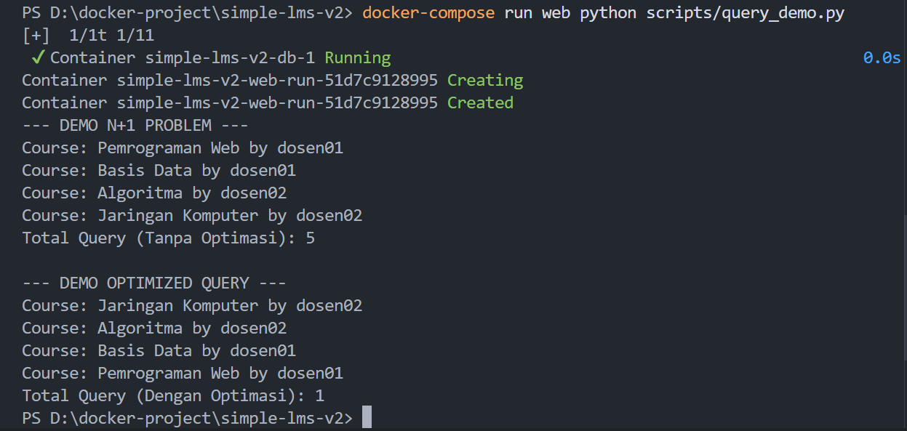

# Simple LMS — Database Design & ORM Implementation

## Cara Menjalankan Project

1. **Clone Project**
    ```bash
    git clone https://github.com/Farihna/docker-project.git
    cd simple-lms
    ```

2. **Siapkan Environtment:**
    Buat file bernama `.env` di root direktori dan isi sesuai dengan `.env.example`. atau dengan menjalankan :
    ```bash
    cp .env.example .env
    ```

3.  **Build dan Run Container:**
    Buka terminal di folder project dan jalankan:
    ```bash
    docker-compose up --build
    ```

4. **Migrasi Database**
    ```bash
    docker-compose exec web python manage.py migrate
    ```

5. **Import data awal**
    ```bash
    docker-compose exec web python manage.py loaddata fixtures/initial_data.json
    ```

6. **Membuat Akun Administrator**
    ```bash
    docker-compose exec web python manage.py createsuperuser
    ```

7. **Akses Aplikasi**

    | URL | Keterangan |
    |---|---|
    | http://localhost:8000/admin/ | Django Admin panel |
    | http://localhost:8000/silk/ | Query profiling dashboard |


8.  **Menghentikan Project:**
    - Stop containers
        ```bash
        docker compose down
        ```
    - Stop dan hapus semua data
        ```bash
        docker compose down -v
        ```

---


## Environment Variables

| Variable | Default | Keterangan |
|---|---|---|
| `SECRET_KEY` | `django-insecure-...` | Secret key Django (ganti di production!) |
| `DEBUG` | `True` | Mode debug (set `False` di production) |
| `ALLOWED_HOSTS` | `localhost,127.0.0.1` | Host yang diizinkan |
| `DB_NAME` | `lms_db` | Nama database PostgreSQL |
| `DB_USER` | `postgres` | Username database |
| `DB_PASSWORD` | `postgres` | Password database |
| `DB_HOST` | `database` | Hostname database (nama service Docker) |
| `DB_PORT` | `5432` | Port database |

---

## Struktur Project

```
simple-lms/
├── code/
│   ├── courses/                 
│   │   ├── migrations/          
│   │   │   ├── 0001_initial.py
│   │   │   ├── 0002_course_enrollment_lesson_progress.py
│   │   │   └── __init__.py
│   │   ├── admin.py             
│   │   ├── apps.py              
│   │   ├── managers.py          
│   │   ├── models.py            
│   │   ├── tests.py             
│   │   ├── views.py             
│   │   └── __init__.py
│   ├── fixtures/                
│   │   ├── courses.csv
│   │   ├── initial_data.json
│   │   └── members.csv
│   ├── lms/                     
│   │   ├── asgi.py              
│   │   ├── settings.py          
│   │   ├── urls.py              
│   │   ├── wsgi.py              
│   │   └── __init__.py
│   ├── scripts/                 
│   │   └── query_demo.py        
│   ├── db.sqlite3               
│   ├── importer.py              
│   └── manage.py                
├── .env                         
├── .env.example                 
├── docker-compose.yaml          
├── Dockerfile                   
└── requirements.txt               
```
---

## Data Models


| Model | Keterangan |
| :--- | :--- |
| **User** | Menggunakan kustomisasi `AbstractUser` dengan field **role** untuk manajemen akses (Admin, Instructor, Student). |
| **Category** | Menggunakan `ForeignKey('self')` untuk mendukung struktur kategori bertingkat atau hierarki. |
| **Course** | Entitas utama kursus yang terhubung secara efisien ke User (Instruktur) dan Category terkait. |
| **Lesson** | Materi pembelajaran dengan field **order** dan pengaturan *ordering* agar materi tampil berurutan bagi siswa. |
| **Enrollment** | Relasi pendaftaran kursus dengan `unique_together` untuk memastikan satu siswa hanya terdaftar satu kali di kursus yang sama. |
| **Progress** | Pencatatan setiap **Lesson** yang berhasil diselesaikan oleh siswa dalam suatu pendaftaran (*Enrollment*). |

---

## Custom Model Managers (Optimasi Query)

* **`Course.objects.for_listing()`**
    Menggunakan `select_related('instructor', 'category')` untuk mengubah N+1 queries menjadi 1 query tunggal pada halaman list kursus.
* **`Enrollment.objects.for_student_dashboard(user)`**
    Menggunakan kombinasi `select_related` dan `prefetch_related` untuk mengambil data kursus dan progres belajar secara instan.

---

## Query Optimization Demo
Jalankan perintah :
```bash
docker-compose run web python scripts/query_demo.py
```

---

## Preview

### Django Admin Dashboard


### List Display yang informatif


### Functional Search


### Functional Filter


### Inline Lesson


---

## Dokumentasi

### Migration Berhasil


### Import Data Berhasil


### Query Demo
