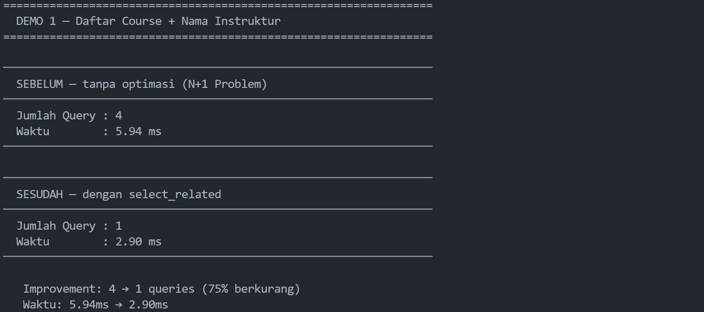
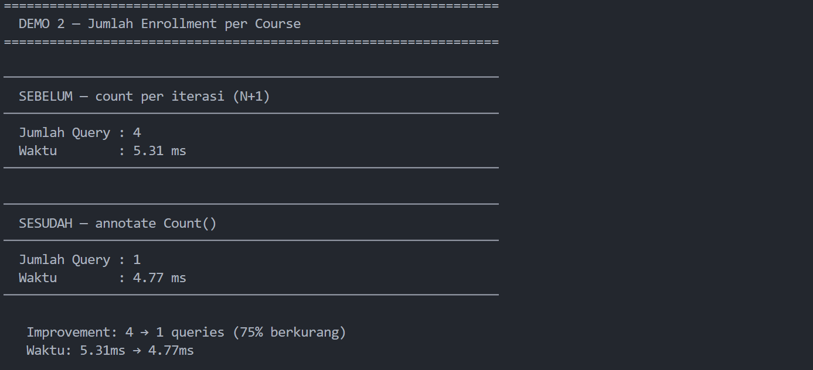
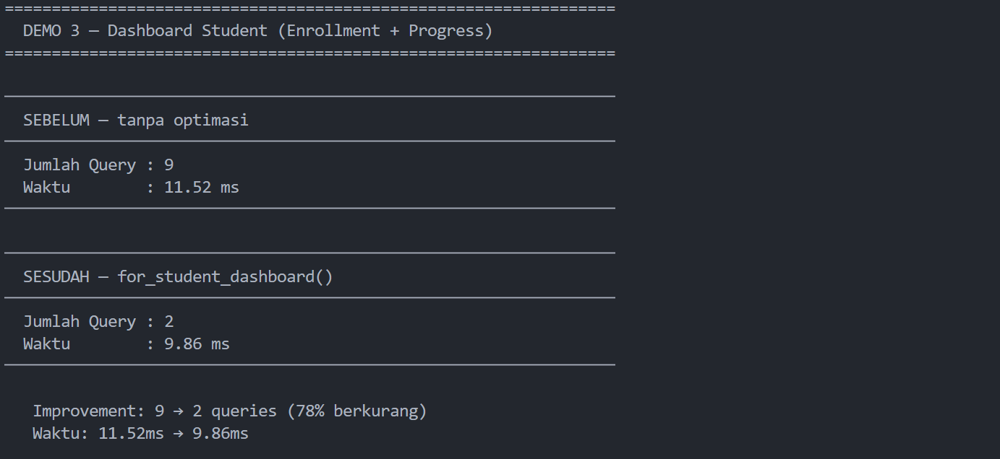
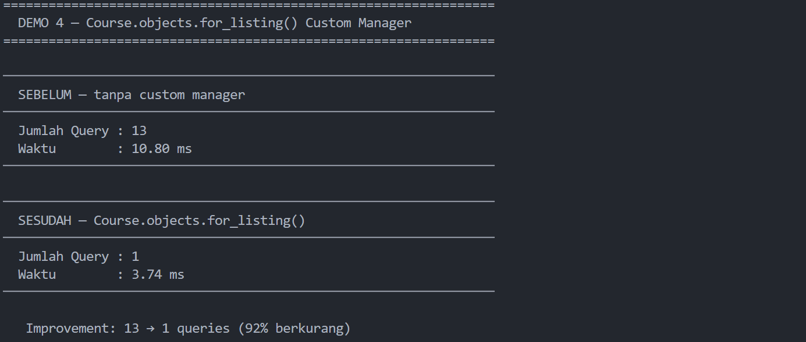
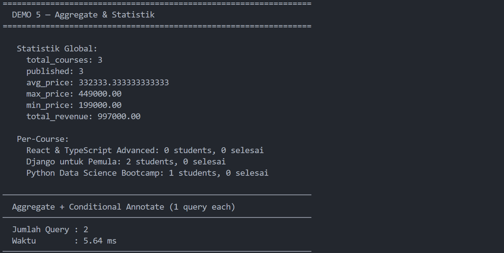
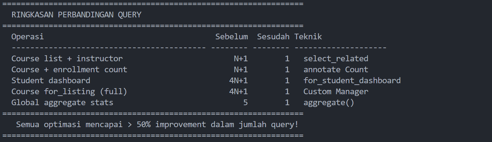
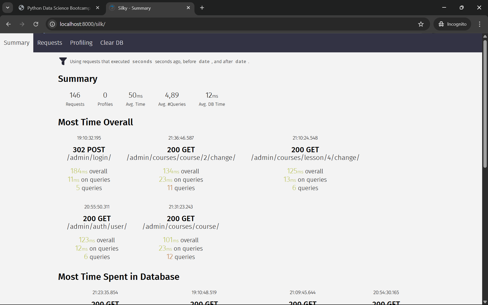

# Simple LMS — Database Design & ORM Implementation

## Cara Menjalankan Project

1. **Clone Project**
    ```bash
    git clone https://github.com/Farihna/docker-project.git
    cd simple-lms
    ```

2. **Siapkan Environtment:**
    Buat file bernama `.env` di root direktori dan isi sesuai dengan `.env.example`. atau dengan menjalankan :
    ```bash
    cp .env.example .env
    ```

3.  **Build dan Run Container:**
    Buka terminal di folder project dan jalankan:
    ```bash
    docker-compose up --build
    ```

4. **Migrasi Database**
    ```bash
    docker-compose exec app python manage.py migrate
    ```

5. **Import data awal**
    ```bash
    docker-compose exec app python manage.py loaddata fixtures/initial_data.json
    ```

6. **Membuat Akun Administrator**
    ```bash
    docker-compose exec app python manage.py createsuperuser
    ```

7. **Akses Aplikasi**

    | URL | Keterangan |
    |---|---|
    | http://localhost:8000/admin/ | Django Admin panel |
    | http://localhost:8000/silk/ | Query profiling dashboard |


8.  **Menghentikan Project:**
    - Stop containers
        ```bash
        docker compose down
        ```
    - Stop dan hapus semua data
        ```bash
        docker compose down -v
        ```

---


## Environment Variables

| Variable | Default | Keterangan |
|---|---|---|
| `SECRET_KEY` | `django-insecure-...` | Secret key Django (ganti di production!) |
| `DEBUG` | `True` | Mode debug (set `False` di production) |
| `ALLOWED_HOSTS` | `localhost,127.0.0.1` | Host yang diizinkan |
| `DB_NAME` | `lms_db` | Nama database PostgreSQL |
| `DB_USER` | `postgres` | Username database |
| `DB_PASSWORD` | `postgres` | Password database |
| `DB_HOST` | `database` | Hostname database (nama service Docker) |
| `DB_PORT` | `5432` | Port database |

---

## Struktur Project

```
simple-lms/
├── docker-compose.yml          
├── Dockerfile                  
├── requirements.txt            
├── .env.example                
├── manage.py                   
│
├── config/                     
│   ├── __init__.py
│   ├── settings.py             
│   ├── urls.py                 
│   └── wsgi.py
│
├── courses/                    
│   ├── __init__.py
│   ├── apps.py
│   ├── models.py               
│   ├── admin.py                
│   └── migrations/
│       ├── __init__.py
│       └── 0001_initial.py     
│
├── fixtures/
│   └── initial_data.json       
│
└── scripts/
    └── query_demo.py           
```
---

### Relasi Antar Model

| Model | Relasi | Ke | Keterangan |
|---|---|---|---|
| `Course` | ForeignKey | `User` | Satu instruktur mengajar banyak course |
| `Course` | ForeignKey | `Category` | Course masuk satu kategori |
| `Category` | ForeignKey (self) | `Category` | Hierarki kategori (tree) |
| `Lesson` | ForeignKey | `Course` | Course punya banyak lesson, ordered |
| `Enrollment` | ForeignKey | `User` | Student enroll ke course |
| `Enrollment` | ForeignKey | `Course` | Course punya banyak enrollment |
| `Progress` | ForeignKey | `Enrollment` | Track lesson selesai per enrollment |
| `Progress` | ForeignKey | `Lesson` | Lesson mana yang diselesaikan |

---


## Data Models

| Model | Keterangan |
| :--- | :--- |
| **UserProfile** | Ekstensi `OneToOne` dari User untuk sistem Role (Admin, Instructor, Student). |
| **Category** | Struktur hierarki kategori menggunakan *self-referencing* (Parent-Child). |
| **Course** | Data utama kursus yang terhubung ke Instructor (User) dan Category. |
| **Lesson** | Materi kelas dengan sistem pengurutan (*ordering*) dan opsi *preview* gratis. |
| **Enrollment** | Relasi pendaftaran siswa ke kursus dengan *constraint* unik per siswa-kursus. |
| **Progress** | Pelacakan status penyelesaian materi dan posisi durasi video per siswa. |

---

## Custom Model Managers (Optimasi Query)

* **`Course.objects.for_listing()`**
    Menggunakan `select_related` (JOIN) dan `annotate` (COUNT) untuk mengambil data instruktur, kategori, jumlah murid, dan jumlah materi dalam **hanya 1 query**.
* **`Enrollment.objects.for_student_dashboard(user)`**
    Dioptimasi untuk dashboard siswa dengan menggabungkan `select_related` dan `prefetch_related` guna menghitung progres penyelesaian kursus secara instan.

---

## Query Optimization Demo
Jalankan perintah :
```bash
docker-compose exec app python scripts/query_demo.py
```

---

## Preview

### Django Admin Dashboard


### List Display yang informatif


### Functional Search


### Functional Filter


### Inline Lesson


---

## Dokumentasi

### Migration Berhasil


### Import Data Berhasil


### Query Demo







### Django Silk Monitoring & Profiling

