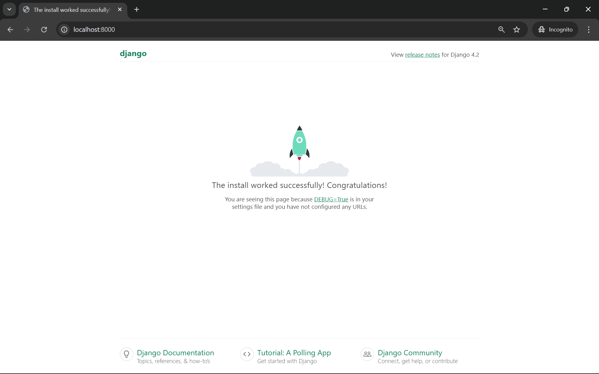
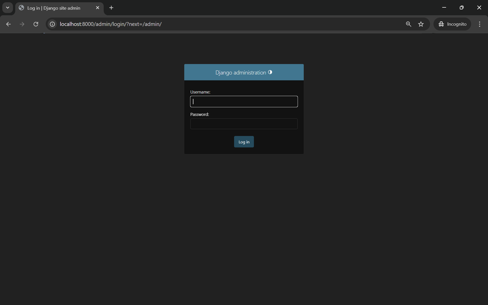
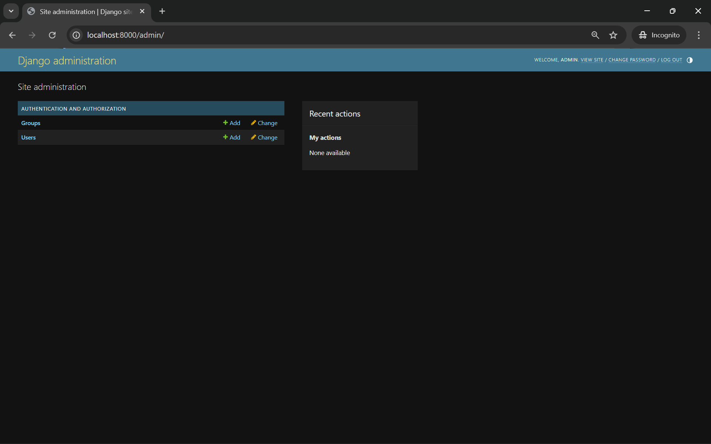
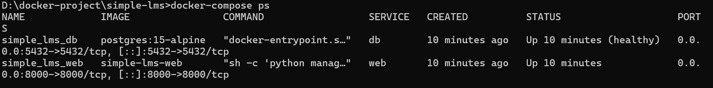

# Simple LMS - Django Docker Project

## Cara Menjalankan Project
1.  **Clone Project:**
    Pastikan semua file (`Dockerfile`, `docker-compose.yml`, dll) berada dalam satu folder `simple-lms/`.

2.  **Siapkan Environment:**
    Buat file bernama `.env` di root direktori dan isi sesuai dengan `.env.example`.

3.  **Build dan Run Container:**
    Buka terminal di folder project dan jalankan:
    ```bash
    docker-compose up -d --build
    ```

4.  **Akses Aplikasi:**
    *   Web App: [http://localhost:8000](http://localhost:8000)
    *   Admin Panel: [http://localhost:8000/admin](http://localhost:8000/admin)

5.  **Membuat Superuser (Opsional):**
    Untuk masuk ke halaman admin, jalankan perintah:
    ```bash
    docker-compose exec web python manage.py createsuperuser
    ```

6.  **Menghentikan Project:**
    ```bash
    # Stop containers (data DB tetap tersimpan)
    docker compose down
    
    # Stop dan hapus semua data (termasuk database)
    docker compose down -v
    ```

---

## Penjelasan Environment Variables

| Variable | Contoh Nilai | Keterangan |
|---|---|---|
| `SECRET_KEY` | `django-...` | Secret key Django untuk enkripsi session & CSRF. **Wajib diganti** di production dengan string random 50+ karakter. |
| `DEBUG` | `True` | Mode debug. Set `False` di production agar error tidak tampil ke user. |
| `ALLOWED_HOSTS` | `localhost,127.0.0.1` | Daftar hostname yang boleh mengakses app, dipisah koma. Di production isi dengan domain kamu. |
| `DB_NAME` | `simple_lms_db` | Nama database PostgreSQL yang akan dibuat otomatis. |
| `DB_USER` | `lms_user` | Username untuk koneksi ke PostgreSQL. |
| `DB_PASSWORD` | `lms_password` | Password database. Gunakan password kuat di production. |
| `DB_HOST` | `db` | Hostname database. Gunakan nama service Docker (`db`), bukan `localhost`. |
| `DB_PORT` | `5432` | Port PostgreSQL (default 5432). |
 
---

## 3. Screenshot Django Welcome Page

Berikut adalah bukti bahwa project telah berjalan dengan sukses:

### Django Welcome Page


> *Catatan: Jika halaman ini tidak muncul karena rute URL sudah diisi, silakan cek halaman `/admin` sebagai bukti koneksi database.*

### Django Admin Login Page


### Django Admin Page


*Catatan: Perlu membuat superuser terlebih dahulu sebelum login dengan menjalankan perintah `docker-compose exec web python manage.py createsuperuser`*

### Docker Container Status
