# Simple LMS — Advanced Features & Integration

## Arsitektur Sistem

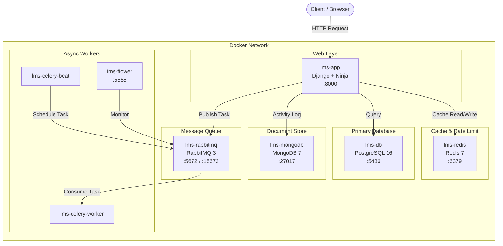

---

## Docker Compose Services

| Service | Image | Port |
|---|---|---|
| lms-app | kaqfa/be_simple_lms-django | :8000 |
| lms-db | postgres:16 | :5436 |
| lms-redis | redis:7-alpine | :6379 |
| lms-mongodb | mongo:7 | :27017 |
| lms-rabbitmq | rabbitmq:3-management-alpine | :5672, :15672 |
| lms-celery-worker | kaqfa/be_simple_lms-django | — |
| lms-celery-beat | kaqfa/be_simple_lms-django | — |
| lms-flower | mher/flower | :5555 |

Semua container berjalan dengan status healthy:

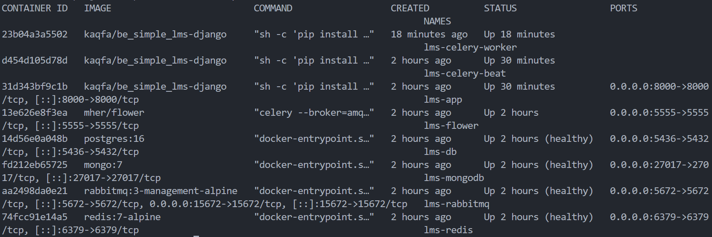

---

## API Documentation

Seluruh endpoint tersedia dan terdokumentasi otomatis via Django Ninja:

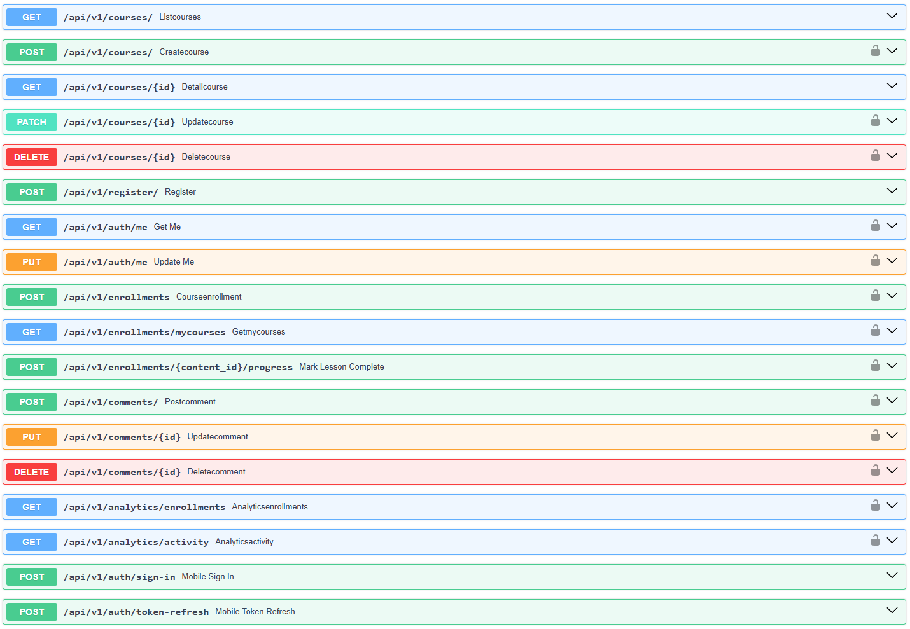

---

## 1. Redis Caching

### Strategi Caching

| Cache Key | Endpoint | TTL |
|---|---|---|
| `lms:course:list` | `GET /api/v1/courses/` | 10 menit |
| `lms:course:detail:{id}` | `GET /api/v1/courses/{id}` | 15 menit |

### Alur Cache

```
Request → Cek Redis
            │
      ┌─────┴─────┐
     HIT          MISS
      │             │
 Return Cache   Query DB → Simpan ke Cache → Return
```

### Bukti Cache Berjalan

Request pertama (cache MISS) membutuhkan waktu lebih lama karena query ke database. Request kedua (cache HIT) jauh lebih cepat karena data diambil langsung dari Redis:

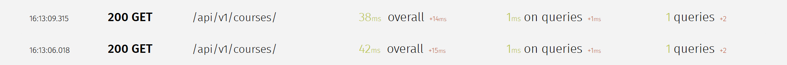

Cache key `lms:course:list` muncul di Redis setelah request pertama. Setelah course baru dibuat (POST), cache list otomatis terhapus (terlihat array kosong karena invalidation):

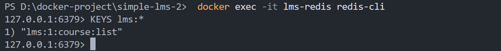
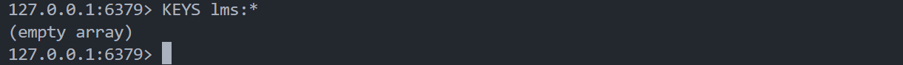

Statistik keyspace hits dan misses di Redis membuktikan caching aktif berjalan:

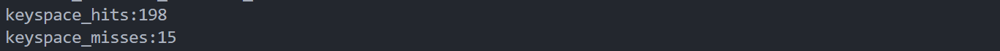

### Cache Invalidation

Cache otomatis dihapus saat data course berubah:

| Aksi | Cache yang Dihapus |
|---|---|
| Create course | `lms:course:list` |
| Update course | `lms:course:list` + `lms:course:detail:{id}` |
| Delete course | `lms:course:list` + `lms:course:detail:{id}` |

### Rate Limiting

- **Limit**: 60 requests/menit per user atau per IP
- **Jika terlampaui**: HTTP 429 Too Many Requests
- **Fail-open**: Jika Redis down, request tetap dilayani

Ketika limit terlampaui, server mengembalikan pesan error dan meminta client menunggu 60 detik:

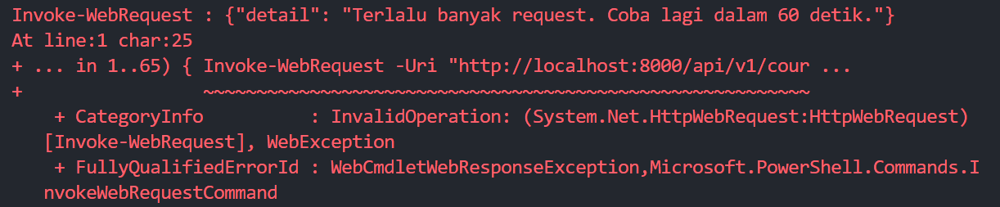

### Redis CLI — Monitoring

```bash
# Masuk Redis CLI
docker exec -it lms-redis redis-cli

KEYS lms:*                  # Lihat semua cache key
TTL lms:course:list         # Sisa waktu cache (detik)
INFO stats                  # Hit/miss rate
DEL lms:course:list         # Hapus cache manual
MONITOR                     # Monitor real-time
```

---

## 2. MongoDB Integration

### Collections

**`activity_logs`** — log setiap aksi user

| Field | Keterangan |
|---|---|
| `event_type` | Jenis event (lihat tabel di bawah) |
| `user_id` | ID user Django |
| `username` | Username |
| `course_id` | Course yang terlibat |
| `metadata` | Data tambahan |
| `created_at` | Timestamp UTC |

**`course_stats`** — snapshot statistik course, di-update Celery Beat tiap jam

### Event Types

| Event | Trigger |
|---|---|
| `user_login` | `GET /auth/me` |
| `view_course` | `GET /courses/` dan `GET /courses/{id}` |
| `enroll_course` | `POST /enrollments` |
| `post_comment` | `POST /comments/` |
| `complete_lesson` | `POST /enrollments/{id}/progress` |
| `export_report` | Celery task export |

### Bukti Activity Log Tersimpan

Setiap aksi user tercatat otomatis di MongoDB collection `activity_logs`:

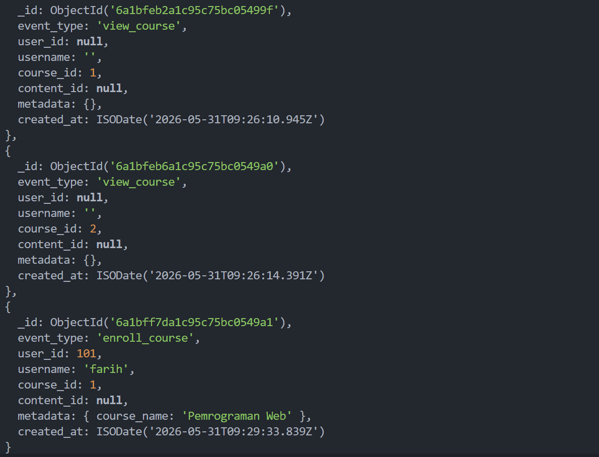

### Analytics Endpoints (Admin Only)

| Endpoint | Keterangan |
|---|---|
| `GET /api/v1/analytics/enrollments` | Jumlah enrollment per course |
| `GET /api/v1/analytics/activity?days=7` | Aktivitas 7 hari terakhir |

---

## 3. Celery Tasks

### Alur Task (Enrollment)

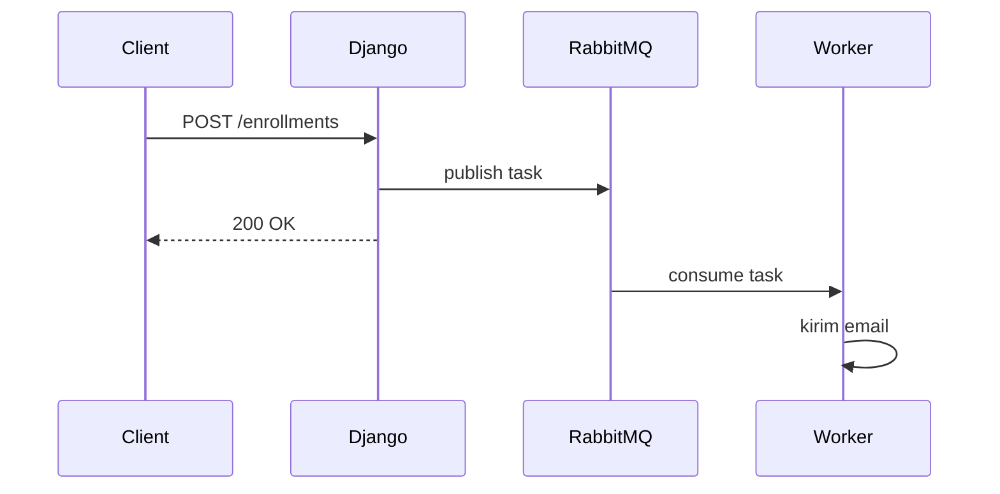

### Daftar Tasks

| Task | Trigger | Fungsi |
|---|---|---|
| `send_enrollment_email` | Saat student enroll | Kirim email konfirmasi |
| `generate_certificate` | Saat semua lesson selesai | Generate file sertifikat |
| `update_course_statistics` | Setiap awal jam (Beat) | Update total member ke MongoDB |
| `export_course_report` | Setiap hari jam 01.00 (Beat) | Export data course ke CSV |

### Bukti Tasks Berjalan

Keempat tasks terdaftar dan berhasil dieksekusi oleh Celery Worker, terpantau via Flower:

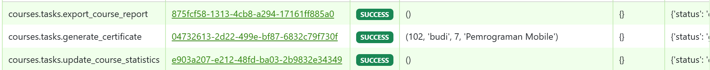
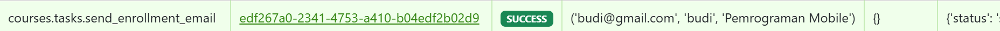
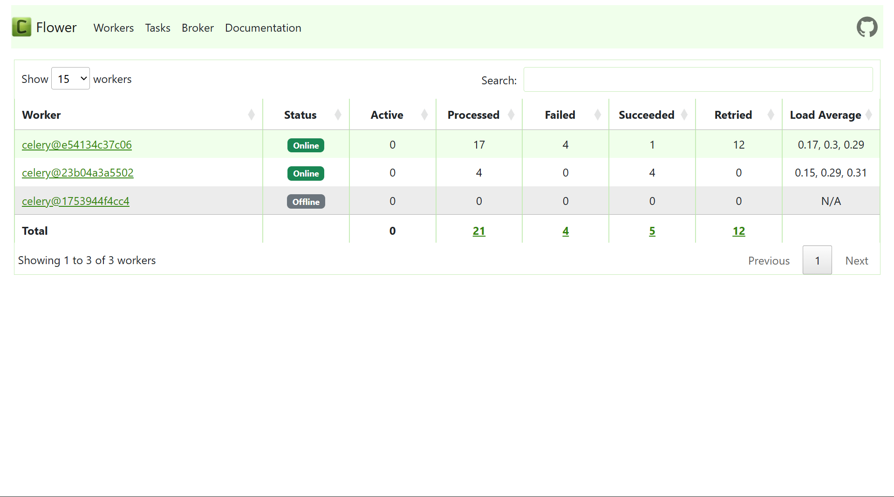

---

## 4. Monitoring

| Layanan | URL | Kredensial |
|---|---|---|
| API Docs | http://localhost:8000/api/v1/docs | — |
| Django Admin | http://localhost:8000/admin | superuser |
| Django Silk | http://localhost:8000/silk/ | superuser |
| Flower | http://localhost:5555 | — |
| RabbitMQ | http://localhost:15672 | guest / guest |

RabbitMQ Management menampilkan koneksi aktif dari Celery worker dan beat:

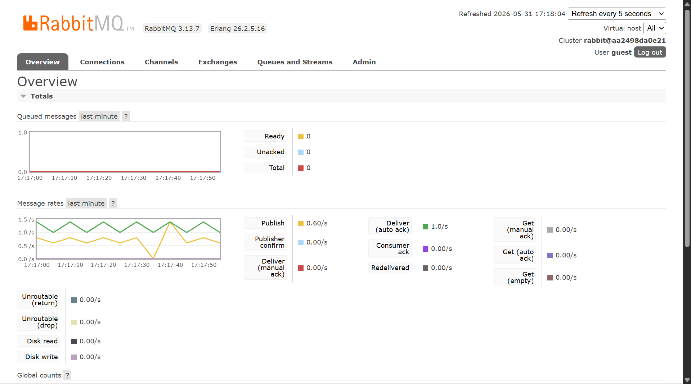

---