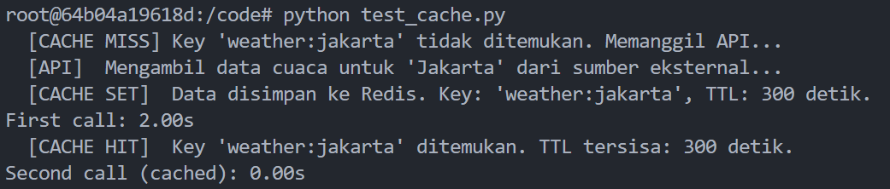
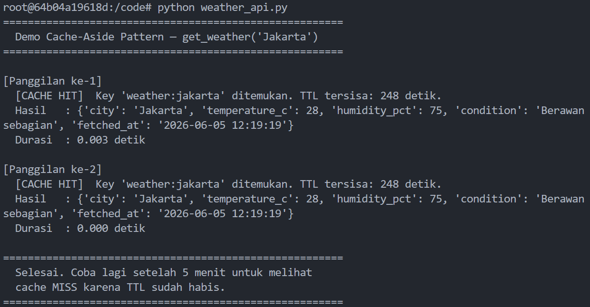

## 1. Screenshot Hasil Test

### `python test_cache.py`


### `python weather_api.py`


> **Catatan:** Kedua panggilan langsung HIT karena `test_cache.py` sudah dijalankan sebelumnya dan cache masih aktif.
---

## 2. Kode yang Dimodifikasi (`weather_api.py`)

```python
import redis
import json
import time

# Koneksi ke Redis (Docker service name: "redis")
r = redis.Redis(host="redis", port=6379, db=0, decode_responses=True)

CACHE_TTL = 300  # 5 menit

def get_weather(city: str) -> dict:
    cache_key = f"weather:{city.lower()}"

    # Langkah 1: Cek cache dulu (GET)
    cached_value = r.get(cache_key)
    if cached_value is not None:
        print(f"  [CACHE HIT]  Key '{cache_key}' ditemukan. TTL tersisa: {r.ttl(cache_key)} detik.")
        return json.loads(cached_value)  # return dari cache

    # Langkah 2: Cache MISS panggil API
    print(f"  [CACHE MISS] Key '{cache_key}' tidak ditemukan. Memanggil API...")
    time.sleep(2)  # simulasi slow API call
    weather_data = {
        "city": city,
        "temperature_c": 28,
        "humidity_pct": 75,
        "condition": "Berawan sebagian",
        "fetched_at": time.strftime("%Y-%m-%d %H:%M:%S"),
    }

    # Langkah 3: Simpan ke cache dengan TTL (SET + EX)
    r.set(cache_key, json.dumps(weather_data), ex=CACHE_TTL)
    print(f"  [CACHE SET]  Data disimpan ke Redis. Key: '{cache_key}', TTL: {CACHE_TTL} detik.")

    return weather_data
```

**Perubahan utama dari kode asli:**
- Ditambahkan koneksi Redis di atas fungsi
- Sebelum call API, dicek dulu apakah data sudah ada di cache (`r.get`)
- Kalau ada -> langsung return, tidak perlu tunggu 2 detik
- Kalau tidak ada -> jalankan API call, lalu simpan hasilnya ke Redis (`r.set` + `ex=300`)

---

## 3. Redis Commands yang Digunakan

### `SET`
Menyimpan data ke Redis. Parameter `ex` menentukan TTL dalam detik — setelah waktu
habis, key otomatis dihapus Redis.

```python
r.set("weather:jakarta", json.dumps(data), ex=300)
# Redis CLI: SET weather:jakarta '{"city":"Jakarta",...}' EX 300
```

### `GET`
Mengambil nilai dari Redis berdasarkan key. Mengembalikan `None` jika key tidak ada
(belum pernah di-set atau sudah expired).

```python
cached_value = r.get("weather:jakarta")
# Redis CLI: GET weather:jakarta
```

### `EXPIRE`
Mengatur atau memperbarui TTL pada key yang sudah ada. Berguna saat ingin
memperpanjang/memperpendek masa hidup cache tanpa harus SET ulang.

```python
r.expire("weather:jakarta", 300)
# Redis CLI: EXPIRE weather:jakarta 300
```
---

## 4. Jawaban Pertanyaan

### Kenapa response time panggilan pertama dan kedua berbeda jauh?

Panggilan pertama mengalami **cache MISS** key `weather:jakarta` belum ada di Redis,
sehingga program harus menjalankan `time.sleep(2)` yang menyimulasikan proses
memanggil API eksternal. Hasilnya: **~2 detik**.

Panggilan kedua mengalami **cache HIT** data sudah tersimpan di Redis dari panggilan
sebelumnya. Program cukup menjalankan `r.get()` yang membaca dari RAM, tanpa perlu
memanggil API sama sekali. Hasilnya: **< 0.01 detik**.

Perbedaannya bisa mencapai **200× lebih cepat**, karena akses RAM jauh lebih cepat
dibanding operasi jaringan/I/O eksternal.

### Apa keuntungan caching?

1. **Respons jauh lebih cepat**, data dari cache bisa dikembalikan dalam milidetik
2. **Beban server berkurang**, API eksternal atau database tidak dipanggil berulang
   untuk data yang sama
3. **Hemat biaya**, banyak API pihak ketiga menagih per request; caching mengurangi
   jumlah request berbayar
4. **Sistem lebih tahan gangguan**, kalau API eksternal down, data di cache masih
   bisa dipakai sementara

### Kapan sebaiknya TIDAK menggunakan cache?

1. **Data harus selalu real-time**, contoh: harga saham, saldo rekening, status
   pesanan yang baru diupdate. Data basi dari cache bisa menyesatkan pengguna.
2. **Data berbeda untuk setiap pengguna**, kalau tiap request menghasilkan key yang
   unik dan tidak pernah dipakai ulang, cache tidak memberikan manfaat.
3. **Data sangat sering berubah**, kalau data berubah lebih cepat dari TTL-nya,
   cache akan terus menyajikan data yang sudah tidak akurat.
4. **Data sensitif**, informasi pribadi atau rahasia sebaiknya tidak disimpan di
   shared cache tanpa enkripsi dan kontrol akses yang ketat.